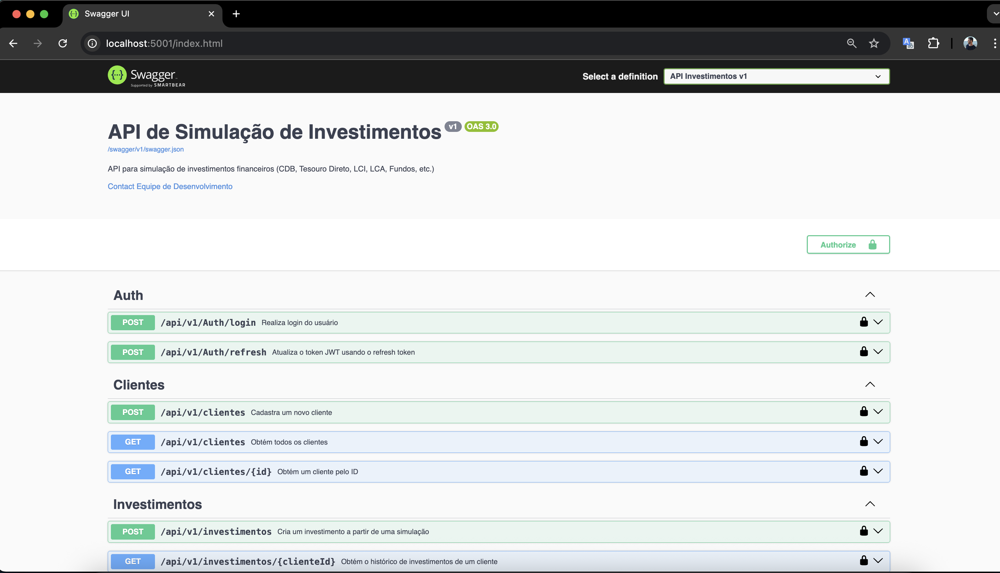
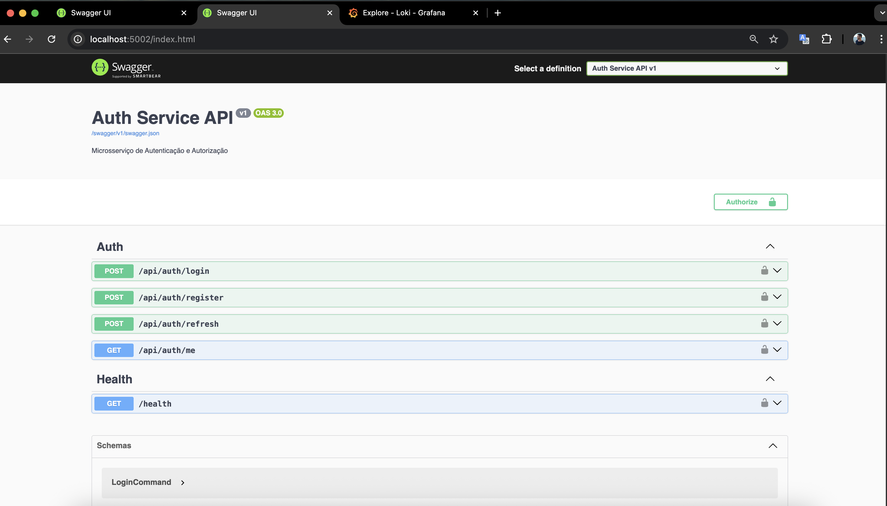
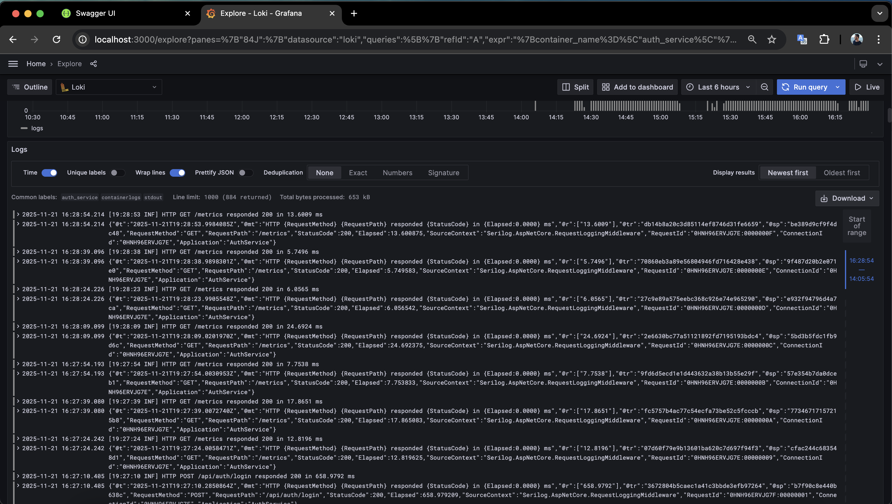
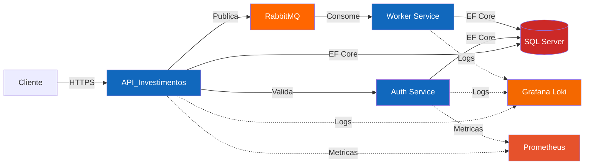

# Sistema de Simulacao de Investimentos

> Painel de Investimentos com Perfil de Risco Dinamico - Desafio Backend .NET

[](https://dotnet.microsoft.com/)
[](https://www.microsoft.com/sql-server)
[](https://www.rabbitmq.com/)
[](https://www.docker.com/)

---

## Quick Start

### Pre-requisitos

- [Docker](https://www.docker.com/get-started) 20.10+
- [Docker Compose](https://docs.docker.com/compose/) 2.0+

### Executar o Sistema

O sistema utiliza **dois profiles Docker**:

| Profile | Descricao | Servicos |
|---------|-----------|----------|
| **core** | Servicos essenciais | API, Auth, Worker, SQL Server, RabbitMQ, Loki, Promtail |
| **observabilidade** | Monitoramento completo | Prometheus, Grafana |


```bash
# Subir apenas servicos core
docker compose --profile core up -d

# Subir com monitoramento completo (Prometheus + Grafana)
docker compose --profile core --profile observabilidade up -d

# Verificar status
docker compose ps
```
**Dica para ver logs com Grafana**: entre na aba Explore > Label Filters > container_name = service que deseja observar os logs

### Acessar Interfaces

| Servico | URL | Credenciais |
|---------|-----|-------------|
| **API Swagger** | http://localhost:5001 | - |
| **Auth Swagger** | http://localhost:5002 | - |
| **RabbitMQ Management** | http://localhost:15672 | admin / admin123 |
| **Grafana Dashboard** | http://localhost:3000 | admin / admin |
| **Prometheus** | http://localhost:9090 | - |





---

## Visao Geral

Sistema distribuido para simulacao de investimentos financeiros (CDB, Tesouro Direto, Fundos, LCI/LCA) com:

- Arquitetura orientada a eventos
- Autenticacao JWT com RBAC
- Observabilidade completa (Serilog + Loki + Prometheus + Grafana)
- Processamento assincrono via RabbitMQ
- Motor de recomendacao por perfil de risco

---

## Arquitetura

Documentacao detalhada:
- [Arquitetura](docs/ARQUITETURA.md): Documentacao completa, diagramas C4, stack tecnologico
- [Design Tecnico](docs/design-tecnico/README.md): Esquema de banco de dados, calculos, eventos

### Componentes



### Tech Stack

| Categoria | Tecnologia |
|-----------|-----------|
| **Backend** | .NET 9, ASP.NET Core, EF Core |
| **Database** | SQL Server 2022 |
| **Message Broker** | RabbitMQ 3.13 |
| **Observabilidade** | Serilog, Grafana Loki, Promtail, Prometheus, Grafana |
| **Autenticacao** | JWT Bearer, BCrypt |
| **Testes** | xUnit, FluentAssertions, NSubstitute |

### Padroes Arquiteturais

- **API_Investimentos**: Clean Architecture + CQRS
- **Auth Service**: Vertical Slice Architecture
- **Worker Service**: Background Service

---

## Endpoints da API

### Auth Service (porta 5002)

```http
POST /api/v1/auth/login          # Login
POST /api/v1/auth/register       # Registrar usuario
POST /api/v1/auth/refresh        # Refresh token
GET  /api/v1/auth/me             # Usuario atual
GET  /health                     # Health check
GET  /metrics                    # Metricas Prometheus
```

### API Investimentos (porta 5001)

#### Simulacoes

```http
POST /api/v1/simulacoes                    # Criar simulacao
GET  /api/v1/simulacoes                    # Listar simulacoes
GET  /api/v1/simulacoes/por-produto-dia    # Agregacao por produto/dia
```

#### Produtos

```http
GET /api/v1/produtos                       # Listar produtos
GET /api/v1/produtos-recomendados/{perfil} # Produtos recomendados
```

#### Perfil de Risco

```http
POST /api/v1/perfil-risco                  # Cadastrar perfil
GET  /api/v1/perfil-risco/{clienteId}      # Obter perfil
```

#### Clientes

```http
POST /api/v1/clientes                      # Cadastrar cliente
GET  /api/v1/clientes                      # Listar clientes
GET  /api/v1/clientes/{id}                 # Obter cliente
```

#### Telemetria

```http
GET /api/v1/telemetria                     # Metricas de uso dos endpoints
```

#### Health & Metrics

```http
GET /metrics                               # Metricas Prometheus
```

### Exemplo de Request

```bash
# Login
curl -X POST http://localhost:5002/api/v1/auth/login \
  -H "Content-Type: application/json" \
  -d '{"email": "admin@teste.com", "senha": "Admin@123"}'

# Criar simulacao
curl -X POST http://localhost:5001/api/v1/simulacoes \
  -H "Authorization: Bearer <token>" \
  -H "Content-Type: application/json" \
  -d '{
    "valor": 10000.00,
    "prazoMeses": 12,
    "tipoProduto": "CDB"
  }'
```

---

## Testes

### Executar Testes

```bash
# Todos os testes
dotnet test

# Testes unitarios com cobertura
dotnet test tests/API_Investimentos.Tests/API_Investimentos.UnitTests --collect:"XPlat Code Coverage"
```

### Cobertura Atual

- **177 testes unitarios**
- Cobertura em entidades, handlers, validators e services

---

## Observabilidade

### Logs Estruturados

- **Formato**: JSON compacto (Serilog CompactJsonFormatter)
- **Armazenamento**: Grafana Loki
- **Coleta**: Promtail

### Metricas

- **Coleta**: prometheus-net
- **Armazenamento**: Prometheus
- **Visualizacao**: Grafana

O dashboard pre-configurado inclui:
- Taxa de requisicoes por endpoint
- Latencia p50/p95
- Contagem de erros
- Volume de logs por servico

### Telemetria de Negocios

O endpoint `/api/v1/telemetria` retorna metricas de uso:
- Quantidade de chamadas por endpoint
- Tempo medio de resposta

---

## Limites de Recursos (Docker)

| Servico | RAM |
|---------|-----|
| API Investimentos | 150 MB |
| Auth Service | 120 MB |
| Worker Simulacao | 100 MB |
| SQL Server | 512 MB |
| RabbitMQ | 150 MB |
| Loki | 100 MB |
| Promtail | 50 MB |
| Prometheus | 200 MB |
| Grafana | 150 MB |

**Total Core**: ~1082 MB
**Total com Observabilidade**: ~1432 MB

---

## Estrutura do Repositorio

```
Projeto_Psi_Investimento/
├── src/
│   ├── API_Investimentos/          # Clean Architecture
│   │   ├── API_Investimentos.Api/
│   │   ├── API_Investimentos.Application/
│   │   ├── API_Investimentos.Domain/
│   │   └── API_Investimentos.Infrastructure/
│   ├── AuthService/                # Minimal API
│   │   └── AuthService.Api/
│   └── Worker_Simulacao/           # Background Service
│       └── Worker_Simulacao/
├── tests/
│   └── API_Investimentos.Tests/
│       ├── API_Investimentos.UnitTests/
│       └── API_Investimentos.IntegrationTests/
├── config/
│   ├── loki.yaml
│   ├── promtail.yaml
│   ├── prometheus.yml
│   └── grafana/
│       └── provisioning/
├── docs/
│   ├── ARQUITETURA.md
│   └── design-tecnico/
├── docker-compose.yml
└── README.md
```

---

## Comandos Uteis

```bash
# Build local
dotnet build

# Executar API localmente
dotnet run --project src/API_Investimentos/API_Investimentos.Api

# Logs em tempo real
docker compose logs -f api-investimentos
docker compose logs -f auth-service

# Parar servicos
docker compose --profile core --profile observabilidade down
```

---

## Seguranca

### Autenticacao & Autorizacao

- **JWT Bearer Tokens**: Access token + Refresh token
- **RBAC**: Roles (Admin, Gerente, Usuario)
- **Password Hashing**: BCrypt

### Usuarios Padrao (Seed)

| Email | Senha | Role |
|-------|-------|------|
| admin@teste.com | Admin@123 | Admin |
| gerente@teste.com | Gerente@123 | Gerente |
| usuario@teste.com | Usuario@123 | Usuario |

---

## Features Implementadas

### Funcionalidades de Negocio

- Simulacao de investimentos (CDB, Tesouro, Fundos, LCI/LCA)
- Calculo de rentabilidade por tipo de produto
- Motor de recomendacao por perfil de risco
- Historico de simulacoes
- Agregacoes por produto/dia
- Telemetria de servicos

### Funcionalidades Tecnicas

- Clean Architecture
- CQRS Pattern
- Event-Driven Architecture (RabbitMQ)
- Repository & Unit of Work
- Strategy Pattern (calculos)
- API Versioning
- Swagger/OpenAPI
- Structured Logging (Serilog + Loki)
- Metricas (Prometheus)
- Dashboard (Grafana)

---

## Autor

**George**

- Desafio: Painel de Investimentos com Perfil de Risco Dinamico
- Foco: Backend .NET, Arquitetura, Testes, Observabilidade

---

## Licenca

Este projeto esta sob a licenca MIT.
