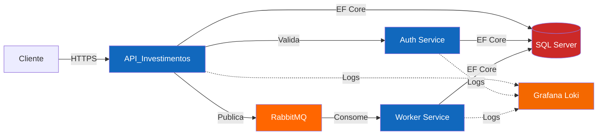

# 🏦 Sistema de Simulação de Investimentos

> Painel de Investimentos com Perfil de Risco Dinâmico - Desafio Backend .NET

[](https://dotnet.microsoft.com/)
[](https://www.microsoft.com/sql-server)
[](https://www.rabbitmq.com/)
[](https://www.docker.com/)
[](LICENSE)

## 📋 Visão Geral

Sistema distribuído para simulação de investimentos financeiros (CDB, Tesouro Direto, Fundos, LCI/LCA) com:

- ✨ Arquitetura orientada a eventos
- 🔐 Autenticação JWT com RBAC
- 📊 Observabilidade completa (logs estruturados, distributed tracing)
- 🧪 TDD com 80%+ cobertura
- 🚀 Processamento assíncrono
- 📈 Motor de recomendação por perfil de risco

---

## 🏗️ Arquitetura

Documentação detahada da arquitetura e design técnico:
- 📐 **[Arquitetura](docs/ARQUITETURA.md)**: Documentação completa da arquitetura, diagramas C4, stack tecnológico
- 📐 **[System Design](docs/design-tecnico/README.md)**: Design Técnico completo, esquema de banco de dados,


### Componentes



### Tech Stack

| Categoria | Tecnologia |
|-----------|-----------|
| **Backend** | .NET 9, ASP.NET Core, EF Core |
| **Database** | SQL Server 2022 |
| **Message Broker** | RabbitMQ 3.13 |
| **Observabilidade** | Serilog, Grafana Loki, Promtail, OpenTelemetry |
| **Autenticação** | JWT Bearer, BCrypt |
| **Cache** | IMemoryCache |
| **Testes** | xUnit, FluentAssertions, Testcontainers, k6 |

### Padrões Arquiteturais

- **API_Investimentos**: Clean Architecture + CQRS
- **Auth Service**: Vertical Slice Architecture + CQRS
- **Worker Service**: Vertical Slice Architecture

---

## 🚀 Quick Start

### Pré-requisitos

- [Docker](https://www.docker.com/get-started) 20.10+
- [Docker Compose](https://docs.docker.com/compose/) 2.0+
- 2GB RAM disponível (core services)

### Executar o Sistema

```bash
# Clonar o repositório
git clone <repo-url>
cd Projeto_Psi_Investimento

# Subir apenas serviços core (API + Auth + Worker + SQL Server + RabbitMQ + Loki)
docker-compose up -d

# Subir com monitoramento completo (adiciona Grafana, Prometheus, Tempo)
docker-compose --profile monitoring up -d

# Verificar status
docker-compose ps

# Verificar saúde da API
curl http://localhost:5000/health
```

### Acessar Interfaces

| Serviço | URL | Credenciais |
|---------|-----|-------------|
| **API Swagger** | http://localhost:5000/swagger | - |
| **RabbitMQ Management** | http://localhost:15672 | admin / admin123 |
| **Grafana Loki** | http://localhost:3100/metrics | - |
| **Grafana Dashboard** | http://localhost:3000 | admin / admin |

---

### Endpoints da API

#### Autenticação

```http
POST /api/v1/auth/login
POST /api/v1/auth/refresh
```

#### Simulações

```http
POST   /api/v1/simulacoes              # Criar simulação
GET    /api/v1/simulacoes              # Listar todas
GET    /api/v1/simulacoes/{id}         # Buscar por ID
GET    /api/v1/simulacoes/por-produto-dia  # Agregação
```

#### Perfil de Risco

```http
GET /api/v1/perfil-risco/{clienteId}
```

#### Produtos

```http
GET /api/v1/produtos-recomendados/{perfil}
```

#### Telemetria

```http
GET /api/v1/telemetria
```

### Exemplo de Request

```json
POST /api/v1/simulacoes
Authorization: Bearer <token>

{
  "clienteId": 123,
  "valor": 10000.00,
  "prazoMeses": 12,
  "tipoProduto": "CDB"
}
```

### Exemplo de Response

```json
{
  "produtoValidado": true,
  "id": 101,
  "nome": "CDB Caixa 2026",
  "tipo": "CDB",
  "rentabilidade": 0.12,
  "risco": "Baixo",
  "resultadoSimulacao": {
    "valorFinal": 11200.00,
    "rentabilidadeEfetiva": 0.12,
    "prazoMeses": 12,
    "dataSimulacao": "2025-11-16T14:00:00Z"
  }
}
```

---

## 🧪 Testes

### Executar Testes

```bash
# Testes unitários
dotnet test --filter Category=Unit

# Testes de integração
dotnet test --filter Category=Integration

# Todos os testes com cobertura
dotnet test /p:CollectCoverage=true /p:CoverletOutputFormat=cobertura

# Gerar relatório de cobertura
reportgenerator -reports:**/coverage.cobertura.xml -targetdir:coverage-report
```

### Testes de Performance

```bash
# Executar teste de carga com k6
k6 run tests/performance/load-test.js

# Com variáveis de ambiente
k6 run -e AUTH_TOKEN=<token> tests/performance/load-test.js
```

### Cobertura Alvo

- **Unit Tests**: 80%+ cobertura
- **Integration Tests**: Todos os fluxos principais
- **E2E Tests**: 5-10 cenários críticos
- **Performance Tests**: < 500ms P95, < 1% erro

---

## 🔐 Segurança

### Autenticação & Autorização

- **JWT Bearer Tokens**: 15 minutos (access token)
- **Refresh Tokens**: 7 dias com rotação automática
- **RBAC**: 3 roles (Admin, Manager, User)
- **Password Hashing**: BCrypt com salt

### Rate Limiting

- **Global**: 100 req/min por IP
- **Simulações**: 20 req/min por IP
- **Response**: HTTP 429 (Too Many Requests)

### Validações

- FluentValidation em todos os commands
- Sanitização de inputs
- CORS configurado
- HTTPS obrigatório (production)

---

## 📊 Observabilidade

### Logs Estruturados

- **Formato**: JSON (Serilog)
- **Armazenamento**: Grafana Loki
- **Coleta**: Promtail
- **Campos**: correlationId, userId, service, timestamp

### Distributed Tracing

- **Instrumentação**: OpenTelemetry
- **Armazenamento**: Grafana Tempo (opcional)
- **Propagação**: W3C Trace Context

### Health Checks

```bash
curl http://localhost:5000/health

curl http://localhost:5000/health/ready

curl http://localhost:5000/health/live
```

### Métricas

- Request count, duration, errors
- Database connection pool
- RabbitMQ queue depth
- Cache hit/miss ratio

---

## 🛠️ Desenvolvimento

### Estrutura do Repositório

```
Projeto_Psi_Investimento/
├── src/
│   ├── API_Investimentos/          # Clean Architecture
│   │   ├── Domain/
│   │   ├── Application/
│   │   ├── Infrastructure/
│   │   └── Presentation/
│   ├── AuthService/                # Vertical Slice
│   │   ├── Features/
│   │   ├── Domain/
│   │   └── Infrastructure/
│   └── WorkerService/              # Vertical Slice
│       ├── Handlers/
│       └── Infrastructure/
├── tests/
│   ├── UnitTests/
│   ├── IntegrationTests/
│   ├── E2ETests/
│   └── PerformanceTests/
├── docs/
│   ├── ARQUITETURA.md
│   ├── CONTEXT.md
│   └── CHANGELOG.md
├── scripts/
│   └── init-db.sh
├── config/
│   ├── promtail.yaml
│   └── tempo.yaml
├── docker-compose.yml
└── README.md
```

### Comandos Úteis

```bash
# Build local
dotnet build

# Restaurar dependências
dotnet restore

# Executar API localmente
dotnet run --project src/API_Investimentos

# Migrations
dotnet ef migrations add InitialCreate --project src/API_Investimentos
dotnet ef database update --project src/API_Investimentos

# Logs em tempo real
docker-compose logs -f api-investimentos
docker-compose logs -f worker-service
```

---

## 📈 Recursos do Sistema

### Consumo de RAM (Docker)

| Configuração | RAM Total | Containers |
|-------------|-----------|------------|
| **Core** (obrigatório) | 1182 MB | API, Auth, Worker, SQL Server, RabbitMQ, Loki, Promtail |
| **Full** (com monitoring) | 1632 MB | Core + Grafana, Prometheus, Tempo |

### Estimativa de Storage

- **Inicial**: ~400 MB
- **1 ano de dados**: ~4 GB

---

## 🎯 Features Implementadas

### Funcionalidades de Negócio

- ✅ Simulação de investimentos (CDB, Tesouro, Fundos, LCI/LCA)
- ✅ Cálculo de rentabilidade por tipo de produto
- ✅ Motor de recomendação por perfil de risco
- ✅ Histórico de simulações
- ✅ Agregações por produto/dia
- ✅ Telemetria de serviços

### Funcionalidades Técnicas

- ✅ Clean Architecture
- ✅ CQRS Pattern
- ✅ Event-Driven Architecture
- ✅ Outbox Pattern
- ✅ Repository & Unit of Work
- ✅ Strategy Pattern (cálculos)
- ✅ Circuit Breaker (Polly)
- ✅ Retry Policies
- ✅ Health Checks
- ✅ API Versioning
- ✅ Swagger/OpenAPI
- ✅ Database Migrations
- ✅ Structured Logging
- ✅ Distributed Tracing
- ✅ Rate Limiting
- ✅ Caching
- ✅ Validation (FluentValidation)

---


## 👤 Autor

**George**

- Desafio: Painel de Investimentos com Perfil de Risco Dinâmico
- Foco: Backend .NET, Arquitetura, Testes, Observabilidade

---

## 📄 Licença

Este projeto está sob a licença MIT. Veja o arquivo [LICENSE](LICENSE) para mais detalhes.

---

## 🙏 Agradecimentos

Desenvolvido como parte do desafio técnico backend .NET, demonstrando:

- Arquitetura de software escalável
- Boas práticas de desenvolvimento
- Testes abrangentes
- Observabilidade completa
- Padrões de design modernos
- Documentação exemplar

---

**Status do Projeto**: 🚧 Em Desenvolvimento

**Versão Atual**: 1.1 (Design Arquitetural Completo)

**Próximos Passos**: Design técnico detalhado → Implementação → Testes → Deploy
