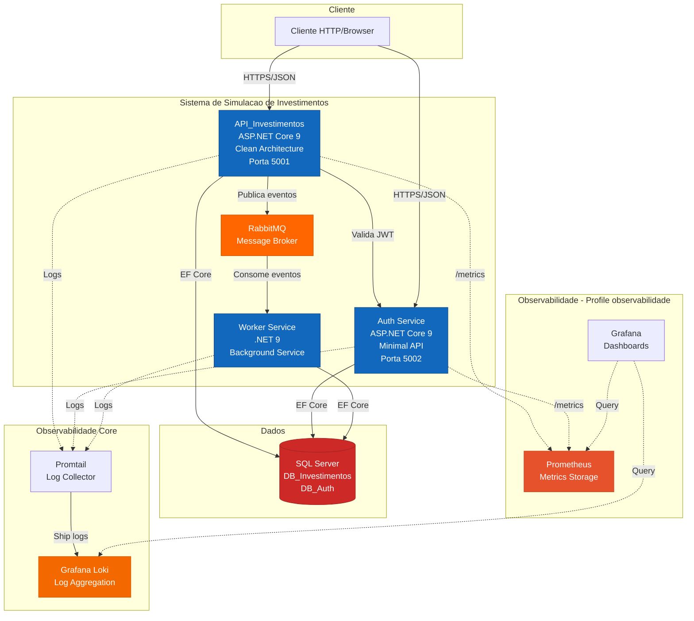

# Arquitetura do Sistema de Simulacao de Investimentos

> **Projeto**: Painel de Investimentos com Perfil de Risco Dinamico
> **Versao**: 2.0
> **Data**: 2025-11-21
> **Autor**: George

## Indice
- [Visao Geral](#visao-geral)
- [Principios Arquiteturais](#principios-arquiteturais)
- [Componentes do Sistema](#componentes-do-sistema)
- [Stack Tecnologico](#stack-tecnologico)
- [Fluxos Principais](#fluxos-principais)
- [Observabilidade](#observabilidade)
- [Seguranca](#seguranca)
- [Deployment](#deployment)
- [Recursos Estimados](#recursos-estimados)

---

## Visao Geral

Sistema distribuido para simulacao de investimentos com arquitetura orientada a eventos, autenticacao centralizada, processamento assincrono e observabilidade completa.

### Objetivos Arquiteturais

1. **Escalabilidade**: Arquitetura preparada para crescimento horizontal
2. **Resiliencia**: Retry policies e fallback strategies
3. **Observabilidade**: Logs estruturados, metricas e dashboards
4. **Manutenibilidade**: Clean code, separacao de responsabilidades, testes
5. **Seguranca**: Autenticacao JWT, RBAC, validacoes robustas

### Diagrama de Containers



---

## Principios Arquiteturais

### 1. Separation of Concerns

- **API_Investimentos**: Clean Architecture (Domain -> Application -> Infrastructure -> Api)
- **Auth Service**: Minimal API com Vertical Slice (Features)
- **Worker**: Background Service

### 2. CQRS (Command Query Responsibility Segregation)

Separacao clara entre operacoes de leitura e escrita.

```
Commands (Write):
├── SimularInvestimentoCommand
├── CadastrarClienteCommand
├── CadastrarPerfilRiscoCommand
└── CriarInvestimentoCommand

Queries (Read):
├── ObterSimulacoesQuery
├── ObterProdutosQuery
├── ObterProdutosRecomendadosQuery
├── ObterPerfilRiscoQuery
├── ObterClientesQuery
└── ObterSimulacoesPorProdutoDiaQuery
```

### 3. Domain-Driven Design (DDD)

**Bounded Contexts**:
- **Investimentos**: Simulacoes, Produtos, Perfil de Risco, Clientes
- **Autenticacao**: Usuarios, Tokens

**Aggregate Roots**:
- `Simulacao`
- `Produto`
- `Cliente`
- `PerfilRisco`

### 4. Event-Driven Architecture (EDA)

Processamento assincrono para operacoes nao criticas:

```
POST /simulacoes -> Retorna imediatamente
                |
        Publica evento em RabbitMQ
                |
        Worker consome e persiste
```

---

## Componentes do Sistema

### 1. API_Investimentos (Porta 5001)

**Responsabilidades**:
- Expor endpoints REST
- Validar autenticacao/autorizacao (JWT)
- Processar simulacoes de investimento
- Publicar eventos em RabbitMQ
- Expor metricas Prometheus (/metrics)
- Telemetria de uso dos endpoints

**Arquitetura**: Clean Architecture

```
API_Investimentos/
├── API_Investimentos.Api/
│   ├── Controllers/
│   │   ├── SimulacoesController.cs
│   │   ├── ProdutosController.cs
│   │   ├── ClientesController.cs
│   │   ├── PerfilRiscoController.cs
│   │   └── TelemetriaController.cs
│   ├── Middleware/
│   │   ├── ExceptionHandlingMiddleware.cs
│   │   └── TelemetriaMiddleware.cs
│   ├── Services/
│   │   └── TelemetriaService.cs
│   └── Program.cs
├── API_Investimentos.Application/
│   ├── Commands/
│   ├── Queries/
│   ├── DTOs/
│   ├── Services/
│   │   └── CalculadoraInvestimentos.cs
│   └── Validators/
├── API_Investimentos.Domain/
│   ├── Entities/
│   ├── ValueObjects/
│   ├── Enums/
│   └── Interfaces/
└── API_Investimentos.Infrastructure/
    ├── Data/
    ├── Repositories/
    └── Messaging/
```

### 2. Auth Service (Porta 5002)

**Responsabilidades**:
- Gerenciar autenticacao (login, refresh token)
- Gerenciar usuarios e roles (RBAC)
- Emitir e validar JWT tokens
- Expor metricas Prometheus (/metrics)

**Arquitetura**: Minimal API com Features

```
AuthService/
└── AuthService.Api/
    ├── Features/
    │   ├── Login/
    │   ├── Register/
    │   ├── RefreshToken/
    │   └── GetCurrentUser/
    ├── Data/
    ├── Shared/
    └── Program.cs
```

**Roles**:
- `Admin`: Acesso total
- `Gerente`: Gerenciamento de recursos
- `Usuario`: Simulacoes e consultas

### 3. Worker Service

**Responsabilidades**:
- Consumir eventos de RabbitMQ
- Persistir simulacoes no banco
- Processar calculos assincronos

```
Worker_Simulacao/
└── Worker_Simulacao/
    ├── Worker.cs
    └── Program.cs
```

### 4. Message Broker (RabbitMQ)

**Exchanges e Queues**:

```
Exchange: simulacoes.events
├── Queue: simulacoes.created
└── Queue: simulacoes.created.dlq (Dead Letter)
```

---

## Stack Tecnologico

### Backend

| Componente | Tecnologia | Versao |
|------------|------------|--------|
| Runtime | .NET | 9.0 |
| API Framework | ASP.NET Core | 9.0 |
| ORM | Entity Framework Core | 9.0 |
| Database | SQL Server | 2022 |
| Message Broker | RabbitMQ | 3.13 |
| Validation | FluentValidation | 11.x |

### Observabilidade

| Componente | Tecnologia | Funcao |
|------------|------------|--------|
| Logging | Serilog | Logs estruturados (JSON) |
| Log Format | CompactJsonFormatter | Formato compacto para Loki |
| Log Aggregation | Grafana Loki | Armazenamento de logs |
| Log Shipping | Promtail | Coleta logs dos containers |
| Metrics | prometheus-net | Metricas HTTP |
| Metrics DB | Prometheus | Time-series database |
| Dashboards | Grafana | Visualizacao |

### Autenticacao & Seguranca

| Componente | Tecnologia |
|------------|------------|
| Auth | JWT Bearer |
| Password Hashing | BCrypt.Net |

### Testes

| Tipo | Framework | Pacotes |
|------|-----------|---------|
| Unit | xUnit | FluentAssertions, NSubstitute |
| Integration | xUnit | WebApplicationFactory |

---

## Observabilidade

### Logs Estruturados (Serilog + Loki)

**Formato**: JSON compacto via CompactJsonFormatter

**Configuracao**:
```json
{
  "Serilog": {
    "Using": ["Serilog.Formatting.Compact"],
    "MinimumLevel": {
      "Default": "Information"
    },
    "WriteTo": [
      {
        "Name": "Console",
        "Args": {
          "formatter": "Serilog.Formatting.Compact.CompactJsonFormatter, Serilog.Formatting.Compact"
        }
      }
    ],
    "Enrich": ["FromLogContext"],
    "Properties": {
      "Application": "API_Investimentos"
    }
  }
}
```

### Metricas (prometheus-net + Prometheus + Grafana)

**Endpoints de metricas**:
- API: http://localhost:5001/metrics
- Auth: http://localhost:5002/metrics

**Metricas coletadas automaticamente**:
- `http_requests_received_total`: Total de requisicoes
- `http_request_duration_seconds`: Duracao das requisicoes
- `http_requests_in_progress`: Requisicoes em andamento

### Dashboard Grafana

Dashboard pre-configurado com:

**Metricas Prometheus**:
- Taxa de requisicoes por endpoint
- Latencia p50/p95
- Total de requisicoes (24h)
- Erros 5xx

**Logs Loki**:
- Logs em tempo real por servico
- Volume de logs por servico
- Contagem de erros

### Telemetria de Negocios

Endpoint `/api/v1/telemetria` retorna:
- Quantidade de chamadas por endpoint
- Tempo medio de resposta (ms)
- Periodo de coleta

---

## Seguranca

### 1. Autenticacao JWT

**Access Token**:
- Duracao: Configuravel
- Claims: sub, email, roles

**Refresh Token**:
- Rotacao automatica
- Armazenado no banco

### 2. RBAC (Role-Based Access Control)

```csharp
[Authorize(Roles = "Admin")]
[HttpDelete("/api/v1/clientes/{id}")]

[Authorize(Roles = "Admin,Gerente")]
[HttpPost("/api/v1/produtos")]

[Authorize]
[HttpPost("/api/v1/simulacoes")]
```

### 3. Validacoes

FluentValidation em todos os commands com regras de:
- Valores minimos/maximos
- Formatos (CPF, email)
- Tipos de produto validos

---

## Deployment

### Docker Compose Profiles

O sistema utiliza dois profiles:

| Profile | Servicos |
|---------|----------|
| **core** | API, Auth, Worker, SQL Server, RabbitMQ, Loki, Promtail |
| **observabilidade** | Prometheus, Grafana |

### Comandos

```bash
# Subir apenas core
docker compose --profile core up -d

# Subir com monitoramento completo
docker compose --profile core --profile observabilidade up -d

# Verificar status
docker compose ps

# Logs em tempo real
docker compose logs -f api-investimentos

# Parar tudo
docker compose --profile core --profile observabilidade down
```

### Portas

| Servico | Porta |
|---------|-------|
| API Investimentos | 5001 |
| Auth Service | 5002 |
| SQL Server | 1433 |
| RabbitMQ Management | 15672 |
| Grafana | 3000 |
| Prometheus | 9090 |
| Loki | 3100 |

---

## Recursos Estimados

### Consumo de Memoria RAM (Docker)

| Container | RAM | Profile |
|-----------|-----|---------|
| API_Investimentos | 150 MB | core |
| Auth Service | 120 MB | core |
| Worker Service | 100 MB | core |
| SQL Server 2022 | 512 MB | core |
| RabbitMQ | 150 MB | core |
| Grafana Loki | 100 MB | core |
| Promtail | 50 MB | core |
| **Total Core** | **1182 MB** | - |
| Prometheus | 200 MB | observabilidade |
| Grafana | 150 MB | observabilidade |
| **Total com Observabilidade** | **1532 MB** | - |

### Limites no Docker Compose

Todos os servicos tem limites de memoria configurados via `deploy.resources.limits.memory`.

---

**Versao**: 2.0
**Ultima atualizacao**: 2025-11-21
**Autor**: George
