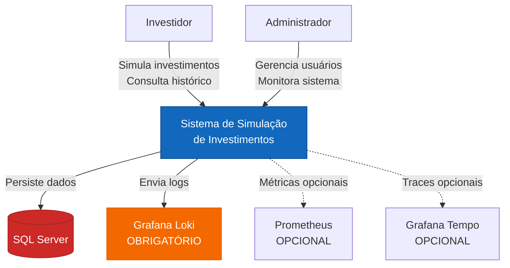
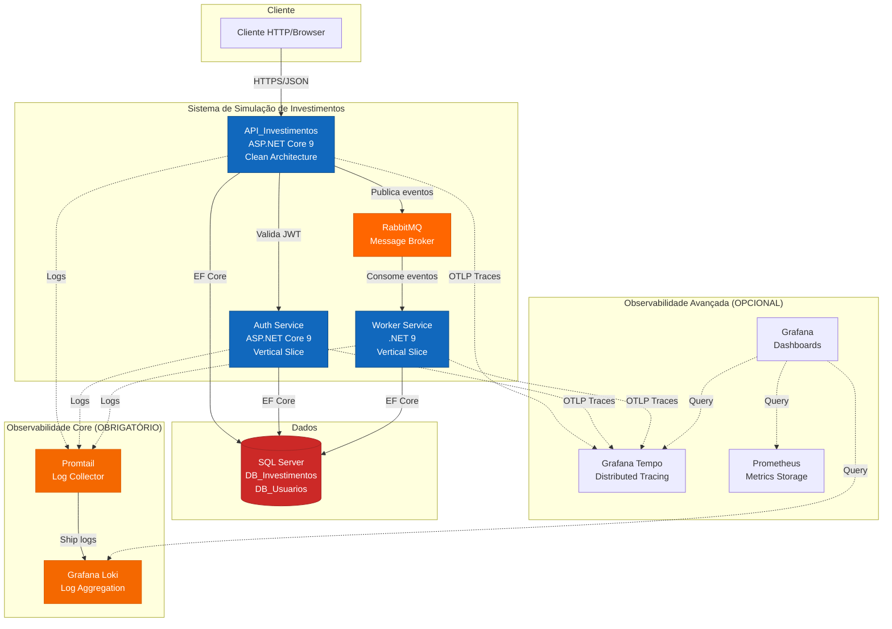
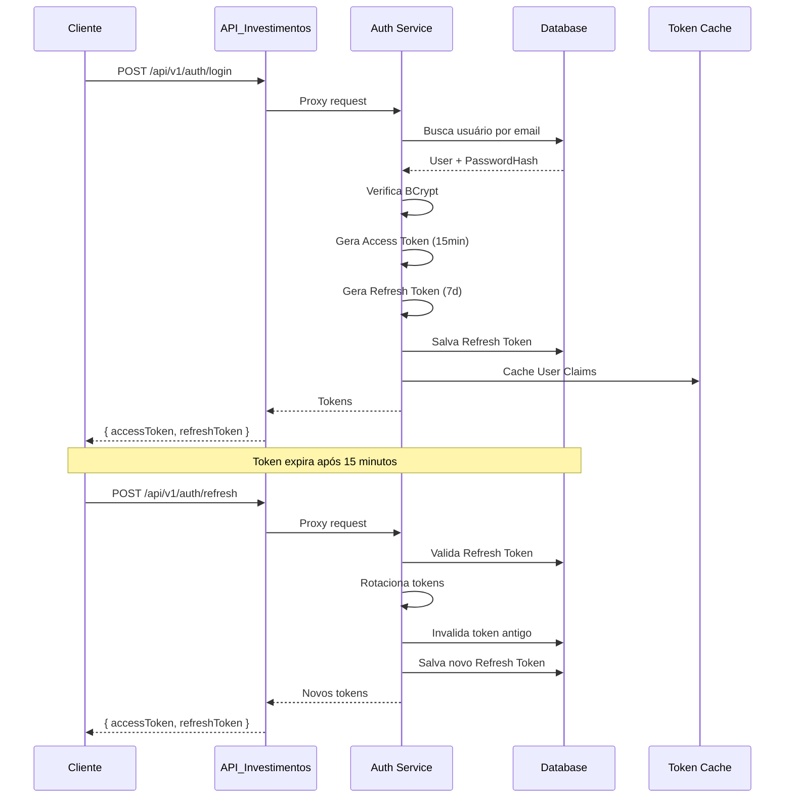
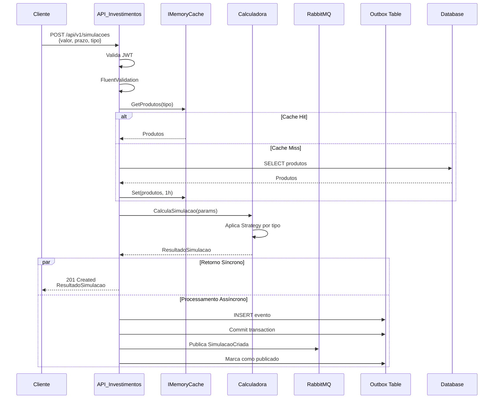
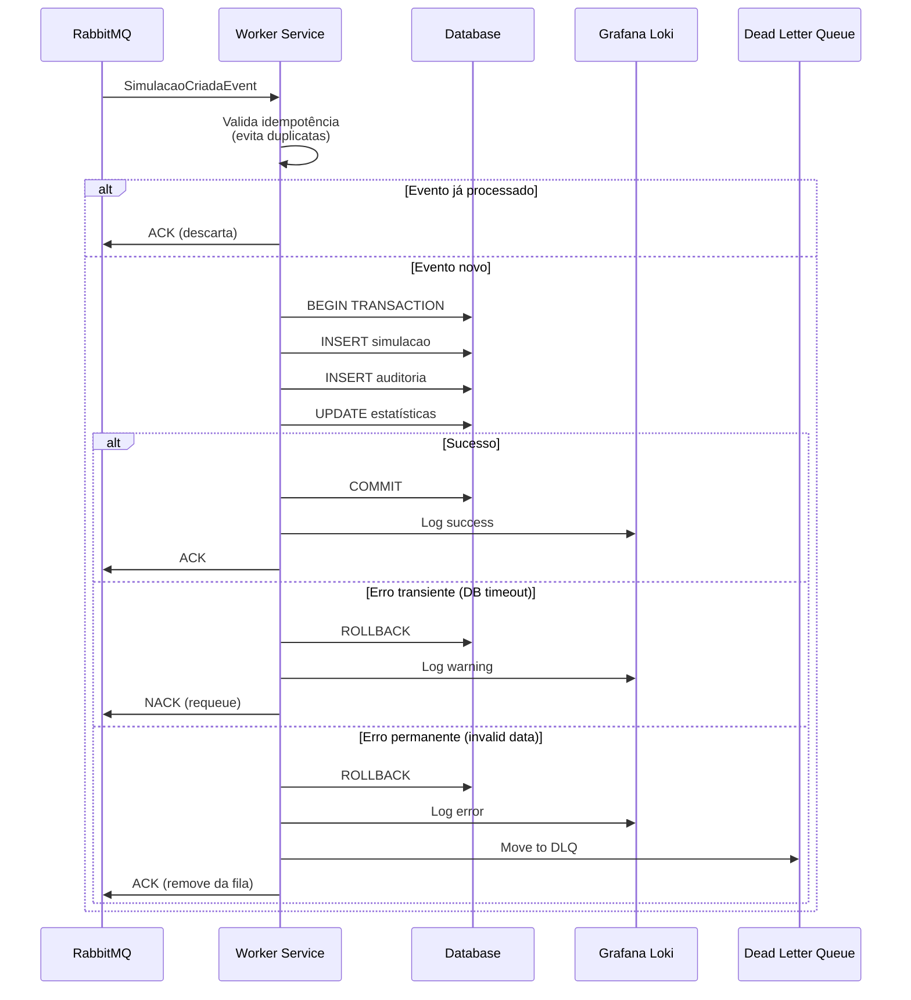
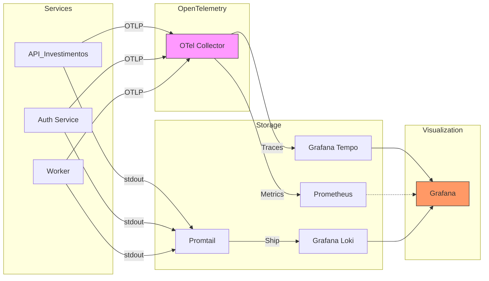

# Arquitetura do Sistema de Simulação de Investimentos

> **Projeto**: Painel de Investimentos com Perfil de Risco Dinâmico
> **Versão**: 1.1
> **Data**: 2025-11-16
> **Autor**: George
> **Última atualização**: 2025-11-16 (Ajuste: PostgreSQL → SQL Server)

## Índice
- [Visão Geral](#visão-geral)
- [Princípios Arquiteturais](#princípios-arquiteturais)
- [Componentes do Sistema](#componentes-do-sistema)
- [Stack Tecnológico](#stack-tecnológico)
- [Fluxos Principais](#fluxos-principais)
- [Estratégia de Testes](#estratégia-de-testes)
- [Observabilidade e Telemetria](#observabilidade-e-telemetria)
- [Segurança](#segurança)
- [Deployment](#deployment)
- [Recursos Estimados](#recursos-estimados)

---

## Visão Geral

Sistema distribuído para simulação de investimentos com arquitetura orientada a eventos, autenticação centralizada, processamento assíncrono e observabilidade completa.

### Objetivos Arquiteturais

1. **Escalabilidade**: Arquitetura preparada para crescimento horizontal
2. **Resiliência**: Retry policies, circuit breakers e fallback strategies
3. **Observabilidade**: Logs estruturados, métricas e distributed tracing
4. **Manutenibilidade**: Clean code, separação de responsabilidades, testes
5. **Segurança**: Autenticação JWT, RBAC, rate limiting, validações robustas

### Diagrama de Contexto (C4 - Level 1)



### Diagrama de Containers (C4 - Level 2)



---

## Princípios Arquiteturais

### 1. Separation of Concerns

- **API_Investimentos**: Clean Architecture (Domain → Application → Infrastructure → Presentation)
- **Auth Service**: Vertical Slice Architecture (feature-based organization)
- **Worker**: Vertical Slice Architecture (handlers por tipo de mensagem)

**Decisão**: Diferentes arquiteturas para demonstrar versatilidade e aplicação contextual.

### 2. CQRS (Command Query Responsibility Segregation)

Separação clara entre operações de leitura e escrita em todos os serviços.

```
Commands (Write):
├── SimularInvestimentoCommand
├── RegisterUserCommand
└── SaveSimulacaoCommand

Queries (Read):
├── GetSimulacoesQuery
├── GetProdutosRecomendadosQuery
└── GetPerfilRiscoQuery
```

### 3. Domain-Driven Design (DDD)

**Bounded Contexts**:
- **Investimentos**: Simulações, Produtos, Perfil de Risco
- **Autenticação**: Usuários, Roles, Tokens

**Aggregate Roots**:
- `Simulacao`
- `Produto`
- `Usuario`

### 4. Event-Driven Architecture (EDA)

Processamento assíncrono para operações não críticas:

```
POST /simulacoes → Retorna imediatamente
                ↓
        Publica evento em RabbitMQ
                ↓
        Worker consome e persiste
```

**Padrões aplicados**:
- **Outbox Pattern**: Garante entrega de eventos mesmo em caso de falha
- **Idempotência**: Workers processam eventos duplicados de forma segura
- **Dead Letter Queue**: Mensagens com falha vão para fila DLQ

---

## Componentes do Sistema

### 1. API_Investimentos

**Responsabilidades**:
- Expor endpoints REST públicos
- Validar autenticação/autorização (JWT)
- Processar simulações de investimento
- Proxy para Auth Service (/auth/login, /auth/refresh)
- Rate limiting e throttling
- Publicar eventos em RabbitMQ

**Arquitetura**: Clean Architecture

```
API_Investimentos/
├── Domain/
│   ├── Entities/
│   │   ├── Simulacao.cs
│   │   └── Produto.cs
│   ├── ValueObjects/
│   │   ├── Money.cs
│   │   ├── PerfilRisco.cs
│   │   └── Rentabilidade.cs
│   ├── Enums/
│   │   ├── TipoProduto.cs
│   │   └── NivelRisco.cs
│   └── Interfaces/
│       └── ISimulacaoService.cs
├── Application/
│   ├── Commands/
│   │   ├── SimularInvestimento/
│   │   │   ├── SimularInvestimentoCommand.cs
│   │   │   ├── SimularInvestimentoCommandHandler.cs
│   │   │   └── SimularInvestimentoCommandValidator.cs
│   ├── Queries/
│   │   ├── GetSimulacoes/
│   │   ├── GetProdutosRecomendados/
│   │   └── GetPerfilRisco/
│   ├── DTOs/
│   ├── Mappings/
│   └── Interfaces/
├── Infrastructure/
│   ├── Persistence/
│   │   ├── ApplicationDbContext.cs
│   │   ├── Repositories/
│   │   └── Configurations/
│   ├── Messaging/
│   │   ├── RabbitMqPublisher.cs
│   │   └── OutboxProcessor.cs
│   ├── Caching/
│   │   └── ProdutosCacheService.cs
│   └── ExternalServices/
│       └── AuthServiceProxy.cs
└── Presentation/
    ├── Controllers/
    ├── Middlewares/
    │   ├── ExceptionHandlingMiddleware.cs
    │   ├── CorrelationIdMiddleware.cs
    │   └── RateLimitingMiddleware.cs
    ├── Filters/
    └── Extensions/
```

**Padrões de Design aplicados**:
- Repository Pattern
- Unit of Work
- Specification Pattern
- Factory Pattern (para cálculos de investimento)
- Strategy Pattern (cálculo por tipo de produto)
- Decorator Pattern (caching, logging)

### 2. Auth Service

**Responsabilidades**:
- Gerenciar autenticação (login, refresh token)
- Gerenciar usuários e roles (RBAC)
- Emitir e validar JWT tokens
- Rotação de refresh tokens

**Arquitetura**: Vertical Slice

```
AuthService/
├── Features/
│   ├── Login/
│   │   ├── LoginEndpoint.cs
│   │   ├── LoginCommand.cs
│   │   ├── LoginHandler.cs
│   │   └── LoginValidator.cs
│   ├── RefreshToken/
│   ├── Register/
│   ├── ManageUsers/
│   └── ManageRoles/
├── Domain/
│   ├── User.cs
│   ├── Role.cs
│   └── RefreshToken.cs
├── Infrastructure/
│   ├── AuthDbContext.cs
│   └── JwtTokenGenerator.cs
└── Common/
    ├── Middlewares/
    └── Extensions/
```

**Roles**:
- `Admin`: Pode tudo (CRUD usuários, deletar)
- `Manager`: CRUD usuários (exceto delete)
- `User`: Apenas simulações e consultas próprias

### 3. Worker Service

**Responsabilidades**:
- Consumir eventos de RabbitMQ
- Persistir simulações no banco
- Enriquecer dados (auditoria, metadados)
- Processar cálculos pesados assíncronos

**Arquitetura**: Vertical Slice

```
WorkerService/
├── Handlers/
│   ├── SimulacaoCreatedHandler.cs
│   ├── SimulacaoUpdatedHandler.cs
│   └── ProcessBatchSimulacoesHandler.cs
├── Infrastructure/
│   ├── RabbitMqConsumer.cs
│   ├── WorkerDbContext.cs
│   └── Repositories/
└── Common/
    ├── HealthChecks/
    └── Extensions/
```

### 4. Message Broker (RabbitMQ)

**Exchanges e Queues**:

```
Exchange: simulacoes.events (topic)
├── Queue: simulacoes.created
│   └── Routing Key: simulacao.created
├── Queue: simulacoes.created.dlq (Dead Letter)
└── Queue: simulacoes.batch
    └── Routing Key: simulacao.batch
```

**Configurações**:
- Durabilidade: Exchanges e queues persistentes
- Prefetch: 10 mensagens por worker
- TTL: 7 dias para mensagens
- DLQ: Retry 3x antes de ir para DLQ

---

## Stack Tecnológico

### Backend

| Componente | Tecnologia | Versão | Justificativa |
|------------|------------|--------|---------------|
| Runtime | .NET | 9.0 | Requisito do desafio, melhor performance |
| API Framework | ASP.NET Core | 9.0 | Framework web moderno, built-in DI |
| ORM | Entity Framework Core | 9.0 | Migrations, LINQ, tracking |
| Database | SQL Server | 2022 | **Requisito do desafio** (SQL Server ou SQLite) |
| Message Broker | RabbitMQ | 3.13 | Confiável, leve, protocolo AMQP |
| Cache | IMemoryCache | Built-in | Suficiente para cache de produtos |
| Validation | FluentValidation | 11.9 | Validações expressivas e testáveis |

### Autenticação & Segurança

| Componente | Tecnologia | Justificativa |
|------------|------------|---------------|
| Auth | JWT Bearer | Stateless, escalável |
| Password Hashing | BCrypt.Net | Algoritmo seguro com salt |
| Rate Limiting | AspNetCoreRateLimit | 4.0 | Proteção contra abuso |

### Observabilidade

| Componente | Tecnologia | Função | Status |
|------------|------------|--------|--------|
| Logging | Serilog | Logs estruturados (JSON) | **OBRIGATÓRIO** |
| Log Aggregation | Grafana Loki | Armazenamento e query de logs | **OBRIGATÓRIO** |
| Log Shipping | Promtail | Coleta logs dos containers | **OBRIGATÓRIO** |
| Tracing | OpenTelemetry | Instrumentação de traces | **OBRIGATÓRIO** |
| Distributed Tracing | Grafana Tempo | Armazenamento de traces | OPCIONAL |
| Metrics | OpenTelemetry (OTLP) | Métricas customizadas | OPCIONAL |
| Metrics DB | Prometheus | Time-series database | OPCIONAL |
| Dashboards | Grafana | Visualização | OPCIONAL |

**Nota**: Logs são essenciais para auditoria e troubleshooting. Loki + Promtail são core. Tracing e métricas visuais são diferenciais opcionais.

### Testes

| Tipo | Framework | Pacotes Adicionais |
|------|-----------|-------------------|
| Unit | xUnit | FluentAssertions, NSubstitute, Bogus |
| Integration | xUnit | WebApplicationFactory, Testcontainers |
| E2E | SpecFlow | Gherkin scenarios |
| Performance | k6 | JavaScript-based load testing |
| Coverage | Coverlet | ReportGenerator |

### DevOps

| Componente | Tecnologia |
|------------|------------|
| Containerização | Docker |
| Orquestração | Docker Compose |
| CI/CD | GitHub Actions (futuro) |
| Documentation | Structurizr (C4), Mermaid, Swagger/OpenAPI |

---

## Fluxos Principais

### 1. Fluxo de Autenticação



### 2. Fluxo de Simulação de Investimento



### 3. Fluxo de Persistência Assíncrona (Worker)



### 4. Fluxo de Observabilidade



---

## Estratégia de Testes

### Pirâmide de Testes

```
           ╱ ╲  E2E (5-10)
          ╱   ╲
         ╱─────╲ Integration (30-50)
        ╱       ╲
       ╱─────────╲ Unit (200-300)
      ╱___________╲
```

### 1. Testes Unitários (80%+ cobertura)

**Framework**: xUnit + FluentAssertions + NSubstitute + Bogus

**Foco**:
- Domain entities e value objects (100%)
- Command/Query handlers (90%)
- Validators (100%)
- Services e strategies (85%)

**Exemplo**:
```csharp
public class SimularInvestimentoCommandValidatorTests
{
    [Theory]
    [InlineData(-100)] // Valor negativo
    [InlineData(0)]    // Zero
    public void DeveInvalidar_QuandoValorInvestidoForInvalido(decimal valor)
    {
        // Arrange
        var command = new SimularInvestimentoCommand { ValorInvestido = valor };
        var validator = new SimularInvestimentoCommandValidator();

        // Act
        var result = validator.Validate(command);

        // Assert
        result.IsValid.Should().BeFalse();
        result.Errors.Should().Contain(e =>
            e.PropertyName == nameof(command.ValorInvestido));
    }
}
```

### 2. Testes de Integração

**Framework**: xUnit + WebApplicationFactory + Testcontainers

**Foco**:
- Endpoints completos (request → response → DB)
- Autenticação/Autorização
- Publicação em RabbitMQ
- Consumo pelo Worker

**Exemplo**:
```csharp
public class SimulacoesEndpointTests : IClassFixture<CustomWebApplicationFactory>
{
    private readonly HttpClient _client;
    private readonly PostgreSqlContainer _postgres;

    [Fact]
    public async Task DeveRetornar201_QuandoSimulacaoForValida()
    {
        // Arrange
        var token = await GetAuthTokenAsync();
        _client.DefaultRequestHeaders.Authorization =
            new AuthenticationHeaderValue("Bearer", token);

        var request = new
        {
            clienteId = 123,
            valor = 10000,
            prazoMeses = 12,
            tipoProduto = "CDB"
        };

        // Act
        var response = await _client.PostAsJsonAsync("/api/v1/simulacoes", request);

        // Assert
        response.StatusCode.Should().Be(HttpStatusCode.Created);
        var result = await response.Content.ReadFromJsonAsync<SimulacaoResponse>();
        result.Should().NotBeNull();
        result.ValorFinal.Should().BeGreaterThan(request.valor);
    }
}
```

### 3. Testes E2E

**Framework**: SpecFlow (BDD) ou xUnit com Docker Compose

**Cenários**:
```gherkin
Feature: Simulação de Investimento End-to-End

Scenario: Cliente simula investimento com sucesso
    Given que existe um usuário autenticado com email "test@example.com"
    And existem produtos cadastrados do tipo "CDB"
    When eu envio uma requisição POST para "/api/v1/simulacoes" com:
        | campo        | valor |
        | clienteId    | 123   |
        | valor        | 10000 |
        | prazoMeses   | 12    |
        | tipoProduto  | CDB   |
    Then a resposta deve ter status 201
    And o corpo deve conter "valorFinal" maior que 10000
    And a simulação deve ser persistida no banco de dados
    And deve existir um log no Loki com correlationId
```

### 4. Testes de Performance

**Framework**: k6

**Cenários**:

```javascript
// load-test.js
import http from 'k6/http';
import { check, sleep } from 'k6';

export let options = {
  stages: [
    { duration: '1m', target: 50 },   // Ramp-up
    { duration: '3m', target: 100 },  // Carga normal
    { duration: '1m', target: 200 },  // Pico
    { duration: '1m', target: 0 },    // Ramp-down
  ],
  thresholds: {
    http_req_duration: ['p(95)<500'], // 95% < 500ms
    http_req_failed: ['rate<0.01'],   // < 1% falhas
  },
};

export default function () {
  const payload = JSON.stringify({
    clienteId: 123,
    valor: 10000,
    prazoMeses: 12,
    tipoProduto: 'CDB',
  });

  const params = {
    headers: {
      'Content-Type': 'application/json',
      'Authorization': `Bearer ${__ENV.AUTH_TOKEN}`,
    },
  };

  let res = http.post('http://localhost:5000/api/v1/simulacoes', payload, params);

  check(res, {
    'status 201': (r) => r.status === 201,
    'tem valorFinal': (r) => JSON.parse(r.body).resultadoSimulacao.valorFinal > 0,
  });

  sleep(1);
}
```

**Métricas alvo**:
- Throughput: 100 req/s
- Latência P95: < 500ms
- Latência P99: < 1s
- Taxa de erro: < 1%

### Cobertura de Testes

**Meta**: 80%+ overall

```
Projeto              | Unit | Integration | Total
---------------------|------|-------------|-------
API_Investimentos    | 85%  | 70%         | 82%
Auth Service         | 90%  | 75%         | 87%
Worker Service       | 88%  | 80%         | 86%
---------------------|------|-------------|-------
Overall              | 87%  | 75%         | 85%
```

**Comando**:
```bash
dotnet test /p:CollectCoverage=true /p:CoverletOutputFormat=cobertura
reportgenerator -reports:**/coverage.cobertura.xml -targetdir:coverage-report
```

---

## Observabilidade e Telemetria

### Pilares

#### 1. Logs Estruturados (Serilog + Loki)

**Configuração**:
```json
{
  "Serilog": {
    "MinimumLevel": {
      "Default": "Information",
      "Override": {
        "Microsoft": "Warning",
        "System": "Warning"
      }
    },
    "WriteTo": [
      { "Name": "Console", "Args": { "formatter": "Serilog.Formatting.Json.JsonFormatter" } }
    ],
    "Enrich": [ "FromLogContext", "WithMachineName", "WithThreadId" ]
  }
}
```

**Campos padronizados**:
- `correlationId`: Rastreamento de requisições
- `userId`: Identificação do usuário
- `service`: Nome do serviço (API, Auth, Worker)
- `environment`: Development, Staging, Production
- `version`: Versão da aplicação

#### 2. Distributed Tracing (OpenTelemetry + Tempo)

**Instrumentação automática**:
- HTTP requests (incoming/outgoing)
- Database queries (EF Core)
- RabbitMQ publish/consume

**Spans customizados**:
```csharp
using var activity = ActivitySource.StartActivity("CalcularSimulacao");
activity?.SetTag("produto.tipo", tipoProduto);
activity?.SetTag("valor.investido", valorInvestido);
// ... lógica ...
activity?.SetStatus(ActivityStatusCode.Ok);
```

#### 3. Métricas Customizadas (OpenTelemetry)

**Exemplos**:
```csharp
// Contador
private static readonly Counter<long> _simulacoesCounter =
    Meter.CreateCounter<long>("simulacoes.total");

_simulacoesCounter.Add(1, new KeyValuePair<string, object>("tipo", tipoProduto));

// Histogram (latência)
private static readonly Histogram<double> _simulacaoDuration =
    Meter.CreateHistogram<double>("simulacao.duration", "ms");

_simulacaoDuration.Record(stopwatch.ElapsedMilliseconds);

// Gauge (itens na fila)
private static readonly ObservableGauge<int> _queueDepth =
    Meter.CreateObservableGauge("rabbitmq.queue.depth", () => GetQueueDepth());
```

### Health Checks

**Endpoints**:
- `/health`: Health geral (UP/DOWN)
- `/health/ready`: Readiness (dependências prontas)
- `/health/live`: Liveness (aplicação responsiva)

**Verificações**:
```csharp
services.AddHealthChecks()
    .AddNpgSql(connectionString, name: "database")
    .AddRabbitMQ(rabbitMqUri, name: "rabbitmq")
    .AddUrlGroup(new Uri(authServiceUrl), name: "auth-service")
    .AddCheck<SimulacaoHealthCheck>("simulacao-logic");
```

**Resposta**:
```json
{
  "status": "Healthy",
  "totalDuration": "00:00:00.1234567",
  "entries": {
    "database": { "status": "Healthy", "duration": "00:00:00.0123456" },
    "rabbitmq": { "status": "Healthy", "duration": "00:00:00.0234567" },
    "auth-service": { "status": "Healthy", "duration": "00:00:00.0345678" }
  }
}
```

### Dashboard Grafana (Opcional)

**Painéis**:
1. **Overview**: Status geral, request rate, error rate
2. **API Performance**: Latências P50/P95/P99, throughput
3. **Database**: Queries/s, connection pool, slow queries
4. **RabbitMQ**: Message rate, queue depth, consumer lag
5. **Business Metrics**: Simulações por produto, valores médios

---

## Segurança

### 1. Autenticação JWT

**Access Token (15 min)**:
```json
{
  "sub": "user-uuid",
  "email": "user@example.com",
  "roles": ["User"],
  "nbf": 1700000000,
  "exp": 1700000900,
  "iat": 1700000000,
  "iss": "AuthService",
  "aud": "API_Investimentos"
}
```

**Refresh Token (7 dias)**:
- Armazenado no banco com hash
- Rotação automática a cada uso
- Revogação manual disponível

### 2. RBAC (Role-Based Access Control)

```csharp
[Authorize(Roles = "Admin")]
[HttpDelete("/api/auth/users/{id}")]
public async Task<IActionResult> DeleteUser(Guid id) { }

[Authorize(Roles = "Admin,Manager")]
[HttpPost("/api/auth/users")]
public async Task<IActionResult> CreateUser(CreateUserRequest request) { }

[Authorize] // Qualquer autenticado
[HttpPost("/api/v1/simulacoes")]
public async Task<IActionResult> SimularInvestimento(SimulacaoRequest request) { }
```

### 3. Rate Limiting

**Configuração (AspNetCoreRateLimit)**:
```json
{
  "IpRateLimiting": {
    "EnableEndpointRateLimiting": true,
    "StackBlockedRequests": false,
    "RealIpHeader": "X-Real-IP",
    "HttpStatusCode": 429,
    "GeneralRules": [
      {
        "Endpoint": "*",
        "Period": "1m",
        "Limit": 100
      },
      {
        "Endpoint": "POST:/api/v1/simulacoes",
        "Period": "1m",
        "Limit": 20
      }
    ]
  }
}
```

### 4. Validações

**FluentValidation**:
```csharp
public class SimularInvestimentoCommandValidator : AbstractValidator<SimularInvestimentoCommand>
{
    public SimularInvestimentoCommandValidator()
    {
        RuleFor(x => x.ClienteId)
            .GreaterThan(0).WithMessage("ClienteId deve ser positivo");

        RuleFor(x => x.ValorInvestido)
            .GreaterThan(0).WithMessage("Valor deve ser positivo")
            .LessThanOrEqualTo(1_000_000).WithMessage("Valor máximo: R$ 1.000.000");

        RuleFor(x => x.PrazoMeses)
            .InclusiveBetween(1, 360).WithMessage("Prazo: 1-360 meses");

        RuleFor(x => x.TipoProduto)
            .IsEnumName(typeof(TipoProduto), caseSensitive: false)
            .WithMessage("Tipo inválido");
    }
}
```

### 5. Tratamento de Erros

**Middleware customizado**:
```csharp
{
  "type": "https://tools.ietf.org/html/rfc7231#section-6.5.1",
  "title": "One or more validation errors occurred.",
  "status": 400,
  "traceId": "00-abc123-def456-00",
  "errors": {
    "ValorInvestido": ["Valor deve ser positivo"]
  }
}
```

**Códigos HTTP**:
- 400: Bad Request (validação)
- 401: Unauthorized (sem token)
- 403: Forbidden (sem permissão)
- 404: Not Found
- 409: Conflict (duplicação)
- 422: Unprocessable Entity (regra de negócio)
- 429: Too Many Requests (rate limit)
- 500: Internal Server Error (erro não tratado)

---

## Deployment

### Docker Compose

**Estrutura**:
```yaml
services:
  # Core Services
  api-investimentos:
    build: ./src/API_Investimentos
    environment:
      - ASPNETCORE_ENVIRONMENT=Production
      - ConnectionStrings__DefaultConnection=Server=sqlserver;Database=DB_Investimentos;User Id=sa;Password=YourStrong@Passw0rd;TrustServerCertificate=True
      - RabbitMQ__Host=rabbitmq
      - AuthService__BaseUrl=http://auth-service:8080
    depends_on:
      - sqlserver
      - rabbitmq
    healthcheck:
      test: ["CMD", "curl", "-f", "http://localhost:8080/health"]
      interval: 30s
      timeout: 10s
      retries: 3
    ports:
      - "5000:8080"
    networks:
      - backend

  auth-service:
    build: ./src/AuthService
    environment:
      - ConnectionStrings__DefaultConnection=Server=sqlserver;Database=DB_Usuarios;User Id=sa;Password=YourStrong@Passw0rd;TrustServerCertificate=True
    depends_on:
      - sqlserver
    networks:
      - backend

  worker-service:
    build: ./src/WorkerService
    environment:
      - RabbitMQ__Host=rabbitmq
      - ConnectionStrings__DefaultConnection=Server=sqlserver;Database=DB_Investimentos;User Id=sa;Password=YourStrong@Passw0rd;TrustServerCertificate=True
    depends_on:
      - rabbitmq
      - sqlserver
    networks:
      - backend

  # Infrastructure
  sqlserver:
    image: mcr.microsoft.com/mssql/server:2022-latest
    environment:
      ACCEPT_EULA: "Y"
      SA_PASSWORD: "YourStrong@Passw0rd"
      MSSQL_PID: "Developer"
    ports:
      - "1433:1433"
    volumes:
      - sqlserver-data:/var/opt/mssql
    networks:
      - backend
    deploy:
      resources:
        limits:
          memory: 512M

  rabbitmq:
    image: rabbitmq:3.13-management-alpine
    environment:
      RABBITMQ_DEFAULT_USER: admin
      RABBITMQ_DEFAULT_PASS: admin123
    ports:
      - "15672:15672" # Management UI
    volumes:
      - rabbitmq-data:/var/lib/rabbitmq
    networks:
      - backend

  # Observability Core (OBRIGATÓRIO - Armazenamento de Logs)
  loki:
    image: grafana/loki:2.9.3
    command: -config.file=/etc/loki/local-config.yaml
    volumes:
      - loki-data:/loki
    ports:
      - "3100:3100"
    networks:
      - observability

  promtail:
    image: grafana/promtail:2.9.3
    volumes:
      - /var/lib/docker/containers:/var/lib/docker/containers:ro
      - ./config/promtail.yaml:/etc/promtail/config.yaml
    command: -config.file=/etc/promtail/config.yaml
    networks:
      - observability
      - backend

  # Observability Avançada (OPCIONAL - Métricas e Visualização)
  tempo:
    image: grafana/tempo:2.3.1
    profiles: ["monitoring"]
    command: [ "-config.file=/etc/tempo.yaml" ]
    volumes:
      - ./config/tempo.yaml:/etc/tempo.yaml
      - tempo-data:/tmp/tempo
    networks:
      - observability
  prometheus:
    image: prom/prometheus:v2.48.0
    profiles: ["monitoring"]
    volumes:
      - ./config/prometheus.yml:/etc/prometheus/prometheus.yml
      - prometheus-data:/prometheus
    networks:
      - observability
      - backend

  grafana:
    image: grafana/grafana:10.2.2
    profiles: ["monitoring"]
    environment:
      - GF_AUTH_ANONYMOUS_ENABLED=true
      - GF_AUTH_ANONYMOUS_ORG_ROLE=Admin
    volumes:
      - ./config/grafana/datasources.yml:/etc/grafana/provisioning/datasources/datasources.yml
      - ./config/grafana/dashboards.yml:/etc/grafana/provisioning/dashboards/dashboards.yml
      - grafana-data:/var/lib/grafana
    ports:
      - "3000:3000"
    networks:
      - observability

networks:
  backend:
  observability:

volumes:
  sqlserver-data:
  rabbitmq-data:
  loki-data:
  tempo-data:
  prometheus-data:
  grafana-data:
```

**Comandos**:
```bash
# Subir apenas core services
docker-compose up -d

# Subir com monitoring
docker-compose --profile monitoring up -d

# Verificar saúde
docker-compose ps
curl http://localhost:5000/health

# Logs
docker-compose logs -f api-investimentos

# Parar tudo
docker-compose down -v
```

---

## Recursos Estimados

### Consumo de Memória RAM (Docker)

| Container | RAM (MB) | CPU Cores | Status | Prioridade |
|-----------|----------|-----------|--------|------------|
| **API_Investimentos** | 150 | 0.5 | **CORE** | Alta |
| **Auth Service** | 120 | 0.25 | **CORE** | Alta |
| **Worker Service** | 100 | 0.25 | **CORE** | Média |
| **SQL Server 2022** | 512 | 0.5 | **CORE** | Alta |
| **RabbitMQ** | 150 | 0.25 | **CORE** | Alta |
| **Grafana Loki** | 100 | 0.25 | **CORE** | Média |
| **Promtail** | 50 | 0.1 | **CORE** | Média |
| **Grafana Tempo** _(opcional)_ | 100 | 0.25 | Opcional | Baixa |
| **Prometheus** _(opcional)_ | 200 | 0.5 | Opcional | Baixa |
| **Grafana** _(opcional)_ | 150 | 0.25 | Opcional | Baixa |
| **Total Core** | **1182 MB** | **2.6** | - | - |
| **Total com Monitoring** | **1632 MB** | **3.6** | - | - |

**Nota**: SQL Server 2022 com limite de 512MB (via Docker deploy limits) é suficiente para desenvolvimento. Production seria 2GB+.

### Limites no Docker Compose

```yaml
services:
  api-investimentos:
    deploy:
      resources:
        limits:
          cpus: '0.5'
          memory: 150M
        reservations:
          cpus: '0.25'
          memory: 100M
```

### Estimativa de Storage

| Componente | Storage |
|------------|---------|
| SQL Server (dados iniciais) | 200 MB |
| SQL Server (1 ano de simulações) | ~3 GB |
| RabbitMQ (queues) | 50 MB |
| Loki (logs 7 dias) | ~500 MB |
| Tempo (traces 7 dias) - opcional | ~300 MB |
| Prometheus (metrics 15 dias) - opcional | ~1 GB |
| **Total Core** | **~3.75 GB** |
| **Total com Monitoring** | **~5 GB** |

---

**Versão**: 1.0
**Última atualização**: 2025-11-18
**Autores**: George