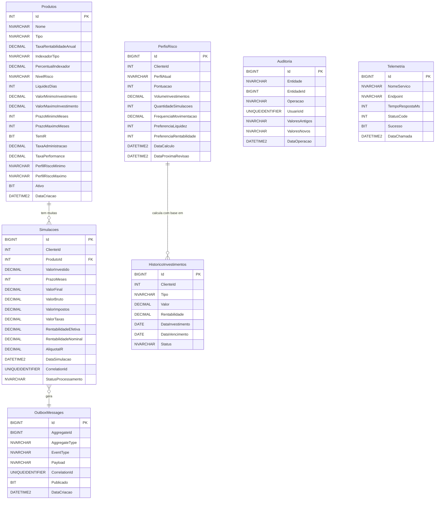

# Database Design - DB_Investimentos

> Schema completo, índices, relacionamentos e estratégias de otimização

---

## Diagrama ER (Entity-Relationship)



---

## Definição de Tabelas

### 1. Produtos

**Propósito**: Catálogo de produtos de investimento disponíveis.

**Schema**:
```sql
CREATE TABLE Produtos (
    -- Identificação
    Id INT IDENTITY(1,1) PRIMARY KEY,
    Nome NVARCHAR(200) NOT NULL,
    Tipo NVARCHAR(50) NOT NULL,

    -- Rentabilidade
    TaxaRentabilidadeAnual DECIMAL(10, 6) NOT NULL,
    IndexadorTipo NVARCHAR(50) NULL,
    PercentualIndexador DECIMAL(5, 2) NULL,

    -- Características
    NivelRisco NVARCHAR(20) NOT NULL,
    LiquidezDias INT NOT NULL,
    ValorMinimoInvestimento DECIMAL(18, 2) NOT NULL,
    ValorMaximoInvestimento DECIMAL(18, 2) NULL,
    PrazoMinimoMeses INT NOT NULL,
    PrazoMaximoMeses INT NOT NULL,

    -- Impostos e taxas
    TemIR BIT NOT NULL DEFAULT 1,
    TaxaAdministracao DECIMAL(5, 4) NULL,
    TaxaPerformance DECIMAL(5, 4) NULL,

    -- Perfil recomendado
    PerfilRiscoMinimo NVARCHAR(20) NOT NULL,
    PerfilRiscoMaximo NVARCHAR(20) NOT NULL,

    -- Metadados
    Ativo BIT NOT NULL DEFAULT 1,
    DataCriacao DATETIME2 NOT NULL DEFAULT GETDATE(),
    DataAtualizacao DATETIME2 NULL,
    Descricao NVARCHAR(1000) NULL,

    -- Constraints
    CONSTRAINT CK_Produtos_Tipo CHECK (
        Tipo IN ('CDB', 'LCI', 'LCA', 'TESOURO_SELIC',
                 'TESOURO_PREFIXADO', 'TESOURO_IPCA',
                 'FUNDO_RENDA_FIXA', 'FUNDO_MULTIMERCADO', 'FUNDO_ACOES')
    ),
    CONSTRAINT CK_Produtos_NivelRisco CHECK (
        NivelRisco IN ('BAIXO', 'MEDIO', 'ALTO')
    ),
    CONSTRAINT CK_Produtos_PerfilRisco CHECK (
        PerfilRiscoMinimo IN ('CONSERVADOR', 'MODERADO', 'AGRESSIVO') AND
        PerfilRiscoMaximo IN ('CONSERVADOR', 'MODERADO', 'AGRESSIVO')
    ),
    CONSTRAINT CK_Produtos_Valores CHECK (
        ValorMinimoInvestimento > 0 AND
        (ValorMaximoInvestimento IS NULL OR ValorMaximoInvestimento >= ValorMinimoInvestimento)
    ),
    CONSTRAINT CK_Produtos_Prazos CHECK (
        PrazoMinimoMeses > 0 AND PrazoMaximoMeses >= PrazoMinimoMeses
    )
);
```

**Índices**:
```sql
-- Query: WHERE Tipo = 'CDB' (filtrar por tipo)
CREATE INDEX IX_Produtos_Tipo ON Produtos(Tipo);

-- Query: WHERE NivelRisco = 'BAIXO' (recomendação)
CREATE INDEX IX_Produtos_NivelRisco ON Produtos(NivelRisco);

-- Query: WHERE Ativo = 1 (listar apenas ativos)
CREATE INDEX IX_Produtos_Ativo ON Produtos(Ativo);

-- Query composta: WHERE Tipo = 'CDB' AND Ativo = 1 (mais comum)
CREATE INDEX IX_Produtos_TipoAtivo ON Produtos(Tipo, Ativo)
    WHERE Ativo = 1; -- Filtered index (menor e mais rápido)
```

**Estimativa de Volume**: ~50-100 produtos (tabela pequena, cache recomendado).

---

### 2. Simulacoes

**Propósito**: Armazena todas as simulações realizadas pelos clientes.

**Schema**:
```sql
CREATE TABLE Simulacoes (
    -- Identificação
    Id BIGINT IDENTITY(1,1) PRIMARY KEY,
    ClienteId INT NOT NULL,
    ProdutoId INT NOT NULL,

    -- Input da simulação
    ValorInvestido DECIMAL(18, 2) NOT NULL,
    PrazoMeses INT NOT NULL,

    -- Output da simulação
    ValorFinal DECIMAL(18, 2) NOT NULL,
    ValorBruto DECIMAL(18, 2) NOT NULL,
    ValorImpostos DECIMAL(18, 2) NOT NULL DEFAULT 0,
    ValorTaxas DECIMAL(18, 2) NOT NULL DEFAULT 0,
    RentabilidadeEfetiva DECIMAL(10, 6) NOT NULL,
    RentabilidadeNominal DECIMAL(10, 6) NOT NULL,

    -- Detalhes do cálculo
    AliquotaIR DECIMAL(5, 4) NULL, -- 22.5%, 20%, 17.5%, 15%
    TaxaAdministracaoAplicada DECIMAL(5, 4) NULL,
    TaxaPerformanceAplicada DECIMAL(5, 4) NULL,

    -- Metadados
    DataSimulacao DATETIME2 NOT NULL DEFAULT GETDATE(),
    CorrelationId UNIQUEIDENTIFIER NOT NULL DEFAULT NEWID(),
    UsuarioId UNIQUEIDENTIFIER NULL,
    IpOrigem NVARCHAR(45) NULL, -- IPv6 support
    UserAgent NVARCHAR(500) NULL,

    -- Status do processamento assíncrono
    StatusProcessamento NVARCHAR(20) NOT NULL DEFAULT 'PENDENTE',
    DataProcessamento DATETIME2 NULL,
    MensagemErro NVARCHAR(MAX) NULL,

    -- Foreign Keys
    CONSTRAINT FK_Simulacoes_Produtos
        FOREIGN KEY (ProdutoId) REFERENCES Produtos(Id),

    -- Constraints
    CONSTRAINT CK_Simulacoes_ValorInvestido CHECK (ValorInvestido > 0),
    CONSTRAINT CK_Simulacoes_PrazoMeses CHECK (PrazoMeses > 0 AND PrazoMeses <= 360),
    CONSTRAINT CK_Simulacoes_ValorFinal CHECK (ValorFinal >= ValorInvestido),
    CONSTRAINT CK_Simulacoes_StatusProcessamento CHECK (
        StatusProcessamento IN ('PENDENTE', 'PROCESSADO', 'ERRO')
    )
);
```

**Índices**:
```sql
-- Query: WHERE ClienteId = 123 (histórico do cliente)
CREATE INDEX IX_Simulacoes_ClienteId ON Simulacoes(ClienteId);

-- Query: WHERE ProdutoId = 5 (análise por produto)
CREATE INDEX IX_Simulacoes_ProdutoId ON Simulacoes(ProdutoId);

-- Query: ORDER BY DataSimulacao DESC (simulações recentes)
CREATE NONCLUSTERED INDEX IX_Simulacoes_DataSimulacao
    ON Simulacoes(DataSimulacao DESC);

-- Query: WHERE StatusProcessamento = 'PENDENTE' (worker busca pendentes)
CREATE INDEX IX_Simulacoes_StatusProcessamento
    ON Simulacoes(StatusProcessamento)
    WHERE StatusProcessamento <> 'PROCESSADO'; -- Filtered index

-- Query: WHERE CorrelationId = '...' (rastreamento)
CREATE INDEX IX_Simulacoes_CorrelationId ON Simulacoes(CorrelationId);

-- COVERING INDEX (query mais comum - histórico do cliente ordenado)
CREATE NONCLUSTERED INDEX IX_Simulacoes_ClienteData
    ON Simulacoes(ClienteId, DataSimulacao DESC)
    INCLUDE (ProdutoId, ValorInvestido, ValorFinal, PrazoMeses, RentabilidadeEfetiva);
    -- INCLUDE permite que o SQL Server resolva a query apenas usando o índice
```

**Estimativa de Volume**: Milhões de registros (particionamento futuro por data).

**Otimização**:
- Considerar particionamento por `DataSimulacao` (mensal/anual)
- Archive de simulações antigas (> 2 anos) para tabela histórica

---

### 3. PerfisRisco

**Propósito**: Perfil de risco calculado para cada cliente.

**Schema**:
```sql
CREATE TABLE PerfisRisco (
    Id BIGINT IDENTITY(1,1) PRIMARY KEY,
    ClienteId INT NOT NULL,

    -- Perfil calculado
    PerfilAtual NVARCHAR(20) NOT NULL,
    Pontuacao INT NOT NULL, -- 0-100

    -- Fatores de cálculo
    VolumeInvestimentos DECIMAL(18, 2) NOT NULL DEFAULT 0,
    QuantidadeSimulacoes INT NOT NULL DEFAULT 0,
    FrequenciaMovimentacao DECIMAL(5, 2) NULL, -- Simulações/mês
    PreferenciaLiquidez INT NULL, -- 0-10
    PreferenciaRentabilidade INT NULL, -- 0-10

    -- Metadados
    DataCalculo DATETIME2 NOT NULL DEFAULT GETDATE(),
    DataProximaRevisao DATETIME2 NOT NULL,
    PerfilAnterior NVARCHAR(20) NULL,
    DataAlteracaoPerfil DATETIME2 NULL,
    VersaoAlgoritmo NVARCHAR(10) NOT NULL DEFAULT '1.0',

    -- Constraints
    CONSTRAINT CK_PerfisRisco_Perfil CHECK (
        PerfilAtual IN ('CONSERVADOR', 'MODERADO', 'AGRESSIVO')
    ),
    CONSTRAINT CK_PerfisRisco_Pontuacao CHECK (Pontuacao BETWEEN 0 AND 100),
    CONSTRAINT CK_PerfisRisco_Preferencias CHECK (
        (PreferenciaLiquidez IS NULL OR PreferenciaLiquidez BETWEEN 0 AND 10) AND
        (PreferenciaRentabilidade IS NULL OR PreferenciaRentabilidade BETWEEN 0 AND 10)
    )
);
```

**Índices**:
```sql
-- Query: WHERE ClienteId = 123 (perfil do cliente)
CREATE INDEX IX_PerfisRisco_ClienteId ON PerfisRisco(ClienteId);

-- Query: ORDER BY DataCalculo DESC (perfis recentes)
CREATE INDEX IX_PerfisRisco_DataCalculo ON PerfisRisco(DataCalculo DESC);

-- Garantir um único perfil ativo por cliente
CREATE UNIQUE INDEX UX_PerfisRisco_ClienteAtivo
    ON PerfisRisco(ClienteId, DataCalculo DESC);
```

**Estimativa de Volume**: Proporcional ao número de clientes (~1M registros).

---

### 4. HistoricoInvestimentos

**Propósito**: Investimentos reais (não simulações) para enriquecer perfil de risco.

**Schema**:
```sql
CREATE TABLE HistoricoInvestimentos (
    Id BIGINT IDENTITY(1,1) PRIMARY KEY,
    ClienteId INT NOT NULL,

    -- Dados do investimento
    Tipo NVARCHAR(50) NOT NULL,
    Valor DECIMAL(18, 2) NOT NULL,
    Rentabilidade DECIMAL(10, 6) NOT NULL,
    DataInvestimento DATE NOT NULL,
    DataVencimento DATE NULL,
    DataResgate DATE NULL,

    -- Status
    Status NVARCHAR(20) NOT NULL DEFAULT 'ATIVO',

    -- Metadados
    DataCriacao DATETIME2 NOT NULL DEFAULT GETDATE(),

    -- Constraints
    CONSTRAINT CK_HistoricoInvestimentos_Status CHECK (
        Status IN ('ATIVO', 'RESGATADO', 'VENCIDO')
    ),
    CONSTRAINT CK_HistoricoInvestimentos_Valor CHECK (Valor > 0)
);
```

**Índices**:
```sql
CREATE INDEX IX_HistoricoInvestimentos_ClienteId
    ON HistoricoInvestimentos(ClienteId);

CREATE INDEX IX_HistoricoInvestimentos_DataInvestimento
    ON HistoricoInvestimentos(DataInvestimento DESC);

-- Covering index para cálculo de perfil
CREATE INDEX IX_HistoricoInvestimentos_PerfilCalculo
    ON HistoricoInvestimentos(ClienteId, Status)
    INCLUDE (Valor, Rentabilidade, DataInvestimento)
    WHERE Status = 'ATIVO';
```

---

### 5. Auditoria

**Propósito**: Log de todas as operações críticas.

**Schema**:
```sql
CREATE TABLE Auditoria (
    Id BIGINT IDENTITY(1,1) PRIMARY KEY,

    -- Identificação
    Entidade NVARCHAR(100) NOT NULL,
    EntidadeId BIGINT NOT NULL,

    -- Operação
    Operacao NVARCHAR(20) NOT NULL,
    UsuarioId UNIQUEIDENTIFIER NULL,

    -- Dados (JSON)
    ValoresAntigos NVARCHAR(MAX) NULL,
    ValoresNovos NVARCHAR(MAX) NULL,

    -- Rastreamento
    CorrelationId UNIQUEIDENTIFIER NULL,
    IpOrigem NVARCHAR(45) NULL,

    -- Timestamp
    DataOperacao DATETIME2 NOT NULL DEFAULT GETDATE(),

    -- Constraints
    CONSTRAINT CK_Auditoria_Operacao CHECK (
        Operacao IN ('INSERT', 'UPDATE', 'DELETE')
    )
);
```

**Índices**:
```sql
CREATE INDEX IX_Auditoria_Entidade
    ON Auditoria(Entidade, EntidadeId);

CREATE INDEX IX_Auditoria_DataOperacao
    ON Auditoria(DataOperacao DESC);

CREATE INDEX IX_Auditoria_CorrelationId
    ON Auditoria(CorrelationId);
```

**Otimização**: Particionamento por mês, archive após 1 ano.

---

### 6. Telemetria

**Propósito**: Métricas de uso dos serviços (requisito do desafio).

**Schema**:
```sql
CREATE TABLE Telemetria (
    Id BIGINT IDENTITY(1,1) PRIMARY KEY,

    -- Identificação do serviço
    NomeServico NVARCHAR(100) NOT NULL,
    Endpoint NVARCHAR(500) NULL,
    MetodoHttp NVARCHAR(10) NULL,

    -- Métricas
    TempoRespostaMs INT NOT NULL,
    StatusCode INT NOT NULL,
    Sucesso BIT NOT NULL,

    -- Rastreamento
    CorrelationId UNIQUEIDENTIFIER NULL,
    UsuarioId UNIQUEIDENTIFIER NULL,

    -- Timestamp
    DataChamada DATETIME2 NOT NULL DEFAULT GETDATE()
);
```

**Índices**:
```sql
-- Query: WHERE NomeServico = 'simular-investimento'
CREATE INDEX IX_Telemetria_NomeServico ON Telemetria(NomeServico);

-- Query: ORDER BY DataChamada DESC
CREATE INDEX IX_Telemetria_DataChamada ON Telemetria(DataChamada DESC);

-- Agregação (endpoint /telemetria)
CREATE INDEX IX_Telemetria_Agregacao
    ON Telemetria(NomeServico, DataChamada, Sucesso)
    INCLUDE (TempoRespostaMs);
```

**Otimização**:
- Particionamento por dia
- Agregação em background (daily summaries)
- Retenção de 90 dias (dados brutos)

---

### 7. OutboxMessages (Outbox Pattern)

**Propósito**: Garantir publicação de eventos no RabbitMQ.

**Schema**:
```sql
CREATE TABLE OutboxMessages (
    Id BIGINT IDENTITY(1,1) PRIMARY KEY,

    -- Identificação
    AggregateId BIGINT NOT NULL,
    AggregateType NVARCHAR(100) NOT NULL,

    -- Evento
    EventType NVARCHAR(100) NOT NULL,
    Payload NVARCHAR(MAX) NOT NULL, -- JSON

    -- Rastreamento
    CorrelationId UNIQUEIDENTIFIER NOT NULL,

    -- Status
    Publicado BIT NOT NULL DEFAULT 0,
    DataCriacao DATETIME2 NOT NULL DEFAULT GETDATE(),
    DataPublicacao DATETIME2 NULL,
    TentativasPublicacao INT NOT NULL DEFAULT 0,
    UltimaTentativa DATETIME2 NULL,
    MensagemErro NVARCHAR(MAX) NULL
);
```

**Índices**:
```sql
-- Query crítica do outbox processor: WHERE Publicado = 0
CREATE INDEX IX_OutboxMessages_NaoPublicados
    ON OutboxMessages(Publicado, DataCriacao)
    WHERE Publicado = 0;

CREATE INDEX IX_OutboxMessages_CorrelationId
    ON OutboxMessages(CorrelationId);
```

**Limpeza**: Job que remove mensagens publicadas com > 7 dias.

---

## Estratégias de Otimização

### 1. Particionamento

```sql
-- Particionar Simulacoes por ano
CREATE PARTITION FUNCTION PF_SimulacoesPorAno (DATETIME2)
AS RANGE RIGHT FOR VALUES
    ('2024-01-01', '2025-01-01', '2026-01-01', '2027-01-01');

CREATE PARTITION SCHEME PS_SimulacoesPorAno
AS PARTITION PF_SimulacoesPorAno
ALL TO ([PRIMARY]);

-- Recriar tabela com particionamento
CREATE TABLE Simulacoes (
    -- ... (mesma definição)
) ON PS_SimulacoesPorAno(DataSimulacao);
```

### 2. Columnstore Index (Telemetria)

```sql
-- Para queries analíticas (agregações)
CREATE NONCLUSTERED COLUMNSTORE INDEX IX_Telemetria_Columnstore
ON Telemetria (NomeServico, DataChamada, TempoRespostaMs, Sucesso);
```

### 3. Filtered Indexes

```sql
-- Apenas simulações dos últimos 30 dias (query mais comum)
CREATE INDEX IX_Simulacoes_Recentes
    ON Simulacoes(ClienteId, DataSimulacao DESC)
    WHERE DataSimulacao >= DATEADD(DAY, -30, GETDATE());
```

### 4. Statistics Update

```sql
-- Manter estatísticas atualizadas
CREATE STATISTICS ST_Simulacoes_ClienteData
    ON Simulacoes (ClienteId, DataSimulacao);

-- Auto-update
ALTER DATABASE DB_Investimentos
SET AUTO_UPDATE_STATISTICS_ASYNC ON;
```

---

## Constraints Resumidas

| Tabela | Constraints Principais |
|--------|----------------------|
| **Produtos** | Tipo ENUM, Risco ENUM, Valores > 0, Prazos válidos |
| **Simulacoes** | Valor > 0, Prazo 1-360, Status ENUM, FK Produtos |
| **PerfisRisco** | Perfil ENUM, Pontuação 0-100, Preferências 0-10 |
| **Auditoria** | Operação ENUM (INSERT/UPDATE/DELETE) |
| **OutboxMessages** | Publicado BIT, TentativasPublicacao >= 0 |

---

## Migrations Strategy

### Versionamento

```
migrations/
├── V1_0_0__Initial_Schema.sql
├── V1_1_0__Add_Telemetria.sql
├── V1_2_0__Add_OutboxPattern.sql
└── V2_0_0__Partitioning_Simulacoes.sql
```

### Migration Template

```sql
-- ============================================
-- Migration: V1_0_0__Initial_Schema
-- Description: Criação inicial do schema
-- Author: George
-- Date: 2025-11-16
-- ============================================

BEGIN TRANSACTION;

-- Criar tabela Produtos
CREATE TABLE Produtos (...);

-- Criar índices
CREATE INDEX IX_Produtos_Tipo ON Produtos(Tipo);

-- Inserir dados seed
INSERT INTO Produtos (...) VALUES (...);

COMMIT TRANSACTION;
```

### Rollback Strategy

```sql
-- Para cada migration V1_X, criar um rollback R1_X
-- R1_0_0__Rollback_Initial_Schema.sql

BEGIN TRANSACTION;

DROP TABLE IF EXISTS Produtos;
DROP TABLE IF EXISTS Simulacoes;

COMMIT TRANSACTION;
```

---

## Estimativas de Tamanho

| Tabela | Registros (1 ano) | Tamanho Estimado |
|--------|------------------|------------------|
| Produtos | 100 | 50 KB |
| Simulacoes | 10.000.000 | 1.5 GB |
| PerfisRisco | 500.000 | 50 MB |
| HistoricoInvestimentos | 2.000.000 | 200 MB |
| Auditoria | 15.000.000 | 2 GB |
| Telemetria | 50.000.000 | 5 GB |
| OutboxMessages | 100.000 | 20 MB (limpo semanalmente) |
| **TOTAL** | | **~9 GB** |

---

## Checklist de Qualidade

- Todas as colunas têm tipos apropriados
- Dinheiro usa DECIMAL (não FLOAT)
- Timestamps usam DATETIME2
- Constraints CHECK para enums
- Foreign Keys definidas
- Índices otimizados para queries comuns
- Covering indexes para queries críticas
- Filtered indexes onde aplicável
- Defaults values para timestamps
- Naming conventions consistentes
- Comentários em queries complexas
- Estratégia de particionamento definida
- Plano de archive/purge definido

---

**Versão**: 1.0
**Última atualização**: 2025-11-16
**Próximo review**: Implementação das migrations
