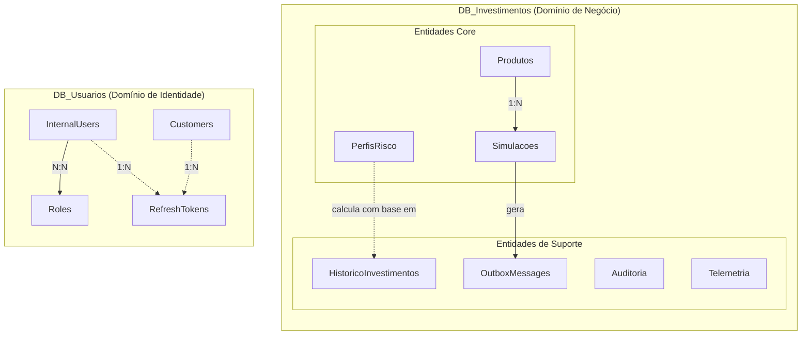

# Design Técnico - Sistema de Simulação de Investimentos

> Documentação detalhada do design técnico, schemas, algoritmos e contratos

---

## Índice de Documentos

### 1. [DATABASE](./DATABASE.md)
**Esquema do Banco de Dados**
- Diagrama ER completo
- Definição de todas as tabelas
- Índices e otimizações
- Constraints e validações
- Scripts SQL comentados
- Estratégia de migrations

### 2. [AUTORIZACAO](./AUTORIZACAO.md)
**Estratégia de Autorização e RBAC**
- Roles para usuários internos vs clientes
- Claims JWT
- Políticas de autorização
- Exemplos de endpoints protegidos
- Fluxo de autenticação completo

### 3. [CALCULOS](./CALCULOS.md)
**Fórmulas de Cálculo de Investimentos**
- Fórmulas de rentabilidade por produto
  - CDB (CDI + spread)
  - Tesouro Direto (Selic, Prefixado, IPCA+)
  - LCI/LCA
  - Fundos de Investimento
- Cálculo de IR regressivo
- Taxas de administração e performance
- Exemplos práticos com números reais

### 4. [MOTOR_RECOMENDACAO](./MOTOR_RECOMENDACAO.md)
**Algoritmo de Perfil de Risco**
- Sistema de pontuação (0-100)
- Fatores que influenciam o perfil
- Classificação (Conservador, Moderado, Agressivo)
- Recomendação de produtos por perfil
- Fluxo de recálculo periódico

### 5. [DTOS](./DTOS.md)
**Contratos de API (DTOs)**
- Requests e Responses de todos os endpoints
- Validações com FluentValidation
- Exemplos JSON
- Versionamento de contratos

### 6. [EVENTOS](./EVENTOS.md)
**Eventos do RabbitMQ**
- Schema de eventos publicados
- Exchanges e Queues
- Routing keys
- Formato JSON dos payloads
- Dead Letter Queue (DLQ)

---

## Objetivo

Esta seção documenta **como** o sistema funciona internamente, complementando a documentação arquitetural que descreve **o que** o sistema faz.

### Diferença entre Arquitetura e Design Técnico

| Aspecto | Arquitetura | Design Técnico |
|---------|-------------|----------------|
| **Foco** | Estrutura geral, componentes | Detalhes de implementação |
| **Nível** | Alto nível (C4, containers) | Baixo nível (tabelas, fórmulas) |
| **Público** | Stakeholders, arquitetos | Desenvolvedores, QA |
| **Pergunta** | "O que o sistema faz?" | "Como o sistema faz?" |

---

## Visão Geral do Sistema

### Bounded Contexts (DDD)



---

## Fluxos de Dados Principais

### 1. Simulação de Investimento

```
Cliente → API_Investimentos → Validação → Cálculo → Response
                 ↓
           OutboxMessages → RabbitMQ → Worker → Persistência
```

### 2. Perfil de Risco

```
Cliente → API_Investimentos → Motor Recomendação → Cálculo Pontuação
                 ↓
           Consulta Histórico + Simulações → Classificação
                 ↓
           Cache (15 min) → Response
```

### 3. Auditoria Completa

```
Operação → Trigger/Application → Auditoria Table → Loki (logs)
               ↓
         OutboxMessages → RabbitMQ → Analytics Worker
```

---

## Convenções e Padrões

### Nomenclatura

- **Tabelas**: PascalCase, plural (ex: `Simulacoes`, `Produtos`)
- **Colunas**: PascalCase, singular (ex: `ClienteId`, `ValorInvestido`)
- **Índices**: `IX_[Tabela]_[Colunas]` (ex: `IX_Simulacoes_ClienteId`)
- **FKs**: `FK_[TabelaOrigem]_[TabelaDestino]`
- **Constraints**: `CK_[Tabela]_[Campo]`

### Tipos de Dados

- **Dinheiro**: `DECIMAL(18, 2)` (máximo 999.999.999.999.999,99)
- **Taxas/Percentuais**: `DECIMAL(10, 6)` (precisão de 6 casas)
- **IDs transacionais**: `BIGINT` (suporta até 9 quintilhões)
- **IDs mestres**: `INT` (suficiente para produtos, clientes)
- **Timestamps**: `DATETIME2` (mais preciso que DATETIME)
- **UUIDs**: `UNIQUEIDENTIFIER` (GUIDs)

### Validações

- **NOT NULL**: Sempre que possível (fail-fast)
- **CHECK constraints**: Validações simples no banco
- **DEFAULT values**: Para timestamps, status, flags
- **Foreign Keys**: COM `ON DELETE` apropriado

---

## Testabilidade

Todos os componentes de design técnico foram projetados para serem testáveis:

### Database
- Scripts idempotentes (podem rodar múltiplas vezes)
- Dados seed isolados por ambiente
- Constraints testáveis

### Cálculos
- Funções puras (mesma entrada = mesma saída)
- Sem dependências externas
- 100% testáveis com unit tests

### Motor de Recomendação
- Algoritmo determinístico
- Pontuação validável
- Casos de teste documentados

---

## Referências

- [DATABASE](./DATABASE.md) - Schema completo
- [AUTORIZACAO](./AUTORIZACAO.md) - RBAC e JWT
- [CALCULOS](./CALCULOS.md) - Fórmulas financeiras
- [MOTOR_RECOMENDACAO](./MOTOR_RECOMENDACAO.md) - Algoritmo de perfil
- [DTOS](./DTOS.md) - Contratos de API
- [EVENTOS](./EVENTOS.md) - Mensageria

---

**Versão**: 1.0
**Data**: 2025-11-18